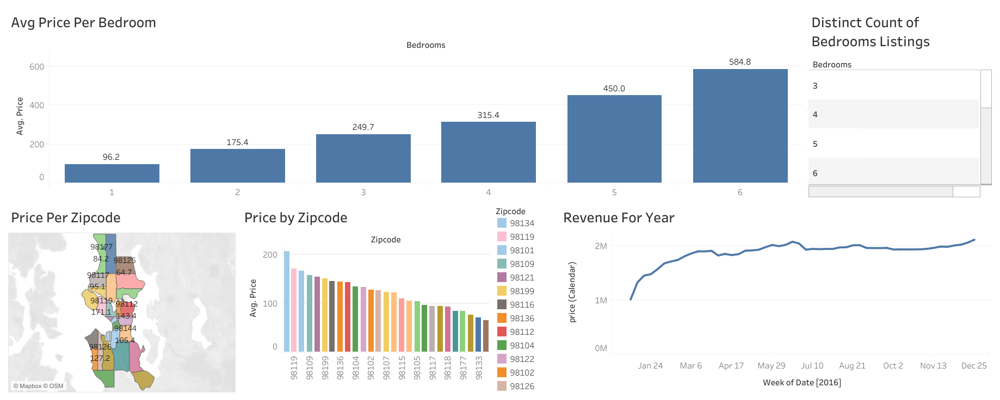

# 🏠 AirBnB Data Analysis — Tableau Dashboard Project



> An end-to-end data visualization project exploring AirBnB listing trends, pricing patterns, and revenue insights across Seattle zipcodes using **Tableau**.

---

## 📌 Table of Contents

- [Project Overview](#project-overview)
- [Dashboard Highlights](#dashboard-highlights)
- [Key Insights](#key-insights)
- [Files Included](#files-included)
- [Tools & Technologies](#tools--technologies)
- [How to Open the Dashboard](#how-to-open-the-dashboard)
- [Dataset Info](#dataset-info)
- [Author](#author)

---

## 📖 Project Overview

This project analyzes publicly available **AirBnB listing data** to uncover pricing behavior, geographic trends, and revenue patterns. The interactive Tableau dashboard provides a comprehensive visual summary, enabling quick decision-making for hosts, investors, or market analysts.

The dashboard answers key questions like:
- How does the **number of bedrooms** affect the average listing price?
- Which **Seattle zipcodes** command the highest average prices?
- How has **revenue trended** throughout the year 2016?

---

## 📊 Dashboard Highlights

The Tableau workbook contains **4 main visualizations**:

### 1. 📦 Avg Price Per Bedroom *(Bar Chart)*
Displays the average nightly price segmented by the number of bedrooms (1–6).  
Trend: Price scales significantly with bedroom count — from **$96.2** (1 bed) to **$584.8** (6 beds).

### 2. 🗺️ Price Per Zipcode *(Map View)*
A geographic map of Seattle showing average listing prices per zipcode region, giving a spatial understanding of where premium listings are concentrated.

### 3. 📊 Price by Zipcode *(Horizontal Bar Chart)*
A ranked bar chart comparing average prices across all Seattle zipcodes.  
Top performers include **98119**, **98109**, and **98199**.

### 4. 📈 Revenue For Year *(Time Series Line Chart)*
Tracks cumulative weekly revenue across **2016**, showing steady growth from ~**$1M** (Jan) to over **$2M** (Dec).

---

## 💡 Key Insights

| Insight | Detail |
|---|---|
| 💰 Highest Avg Price | 6-bedroom listings avg **$584.8/night** |
| 📍 Priciest Zipcode | **98119** leads with avg price ~$200+ |
| 📅 Revenue Peak | Revenue surges in **mid-year (May–Aug)** |
| 🏘️ Most Listings | 3–4 bedroom properties dominate the listing count |
| 📉 Budget Friendly | Zipcode **98133** offers the lowest avg prices |

---

## 📁 Files Included

```
📦 AirBnB-Tableau-Project/
├── 📊 AirBnB_Full_Project.twbx   # Tableau packaged workbook (all data + visuals)
├── 🖼️  AirBnB_Project.png         # Dashboard screenshot / preview image
└── 📄 README.md                   # Project documentation (this file)
```

---

## 🛠️ Tools & Technologies

| Tool | Purpose |
|---|---|
| **Tableau Desktop / Public** | Dashboard creation & data visualization |
| **AirBnB Open Dataset** | Source data (listings, calendar, reviews) |
| **Mapbox / OSM** | Geographic map rendering in Tableau |

---

## 🚀 How to Open the Dashboard

1. Download **[Tableau Public](https://public.tableau.com/en-us/s/download)** *(free)* or use Tableau Desktop.
2. Clone or download this repository.
3. Open the file `AirBnB_Full_Project.twbx` directly in Tableau.
4. Explore the interactive dashboard — filter by **bedroom count** or **zipcode** using the built-in controls.

> ⚠️ `.twbx` is a *packaged workbook* — it includes the data source, so no additional dataset download is needed.

---

## 🗂️ Dataset Info

- **Source:** AirBnB Seattle Open Data (via Kaggle / Inside AirBnB)
- **Year Covered:** 2016
- **Geography:** Seattle, Washington, USA
- **Key Fields Used:** `zipcode`, `bedrooms`, `price`, `date`, `calendar price`

---

## 👤 Author

**Rahul**  
BCA Graduate | MCA Student | Aspiring Data Analyst  

[](https://github.com/)

---

> ⭐ *If you found this project helpful, consider giving it a star!*
